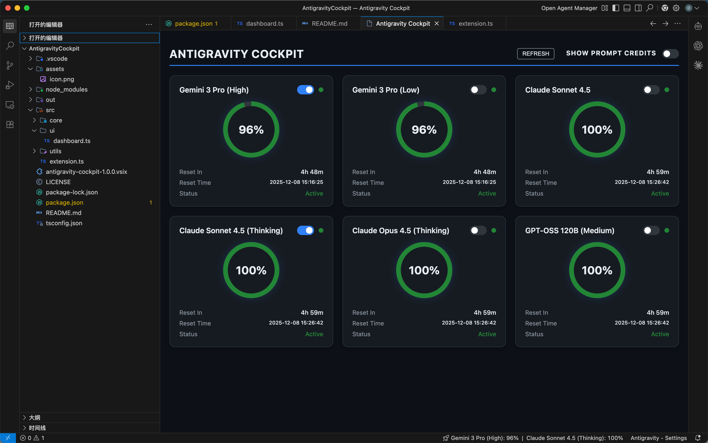

# Antigravity Cockpit 🚀

> A futuristic dashboard for monitoring Google Antigravity AI quotas in VS Code.

[](https://marketplace.visualstudio.com/items?itemName=antigravity-community.antigravity-cockpit)
[](https://github.com/jlcodes99/vscode-antigravity-cockpit)

**Antigravity Cockpit** transforms your coding experience with a premium, Cyberpunk-styled HUD for monitoring AI model quotas. Say goodbye to guessing when your models limits reset.



---

## ✨ Features

- **🚀 Immersive Dashboard**
  A beautiful, dark-mode Webview visualization of all your AI models (**Gemini 3 Pro**, **Claude Sonnet 4.5**, **GPT-OSS 120B**, etc.) with real-time health gauges.

- **⏱️ Precision Timing**
  Know *exactly* when to get back to work. Displays both a countdown (e.g., `4h 40m`) and the absolute reset timestamp (e.g., `15:16:25`).

- **👆 Interactive Control**
  - **Drag & Drop**: Arrange models exactly how you want them. Your layout is saved automatically.
  - **Pin to Bar**: Toggle which models appear in your VS Code status bar directly from the card.
  - **One-Click Refresh**: Need data now? Hit the refresh button (60s cooldown).

- **📊 Smart Status Bar**
  - Shows pinned models side-by-side (e.g., `🚀 Gemini 3 Pro: 95% | Claude Sonnet 4.5: 100%`).
  - If nothing is pinned, intelligently monitors the **lowest quota** model to keep you safe.
  
- **💎 Stable & Fast**
  - **Instant Rehydration**: Dashboard state is cached, so it loads instantly even after being backgrounded.
  - **Zero-Config**: Auto-detects local Antigravity processes without manual setup.

## 🕹️ Usage

1. **Open**: Click the **$(rocket) Cockpit** item in your status bar.
2. **Customize**:
   - **Pin**: Flip the switch on a model card to see it in the status bar.
   - **Order**: Drag cards to reorder.
   - **Credits**: Toggle "Show Prompt Credits" at the top right if you use them.

## ⚙️ Configuration

We believe in **Interactivity over Configuration**. All major preferences (Sorting, Pinning, Visibility) are managed directly via the UI.

Advanced settings in `settings.json`:
- `agCockpit.refreshInterval`: Polling frequency in seconds (default: `60`).

## 🔧 Building from Source

1. Clone the repository:
   ```bash
   git clone https://github.com/jlcodes99/vscode-antigravity-cockpit.git
   ```
2. Install dependencies:
   ```bash
   npm install
   ```
3. Run the extension (F5 in VS Code).

## 🤝 Contributing

Contributions are welcome! Please feel free to submit a Pull Request.

## License

[MIT](LICENSE)
